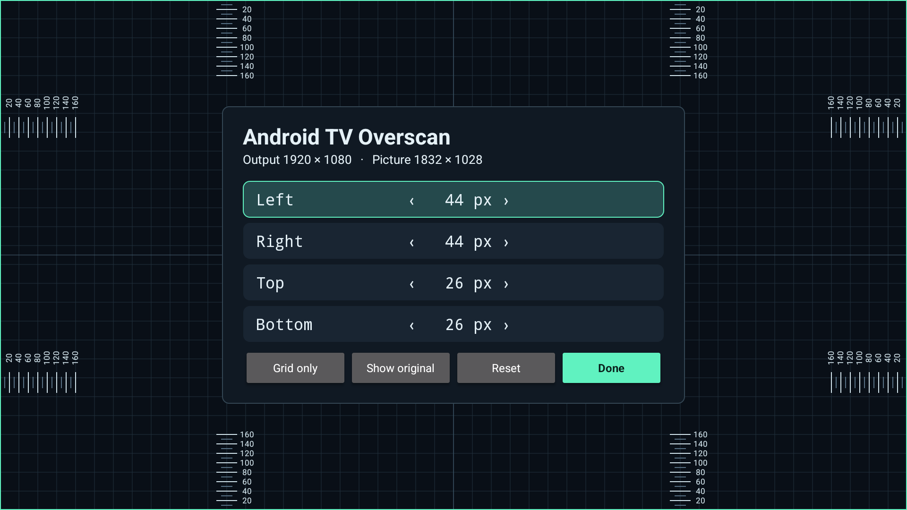

# Android TV Overscan

Fix overscan and cropped screen edges on an Android TV or Google TV box connected to a TV or projector. If the picture looks zoomed in, the screen is too big, or menus are cut off at the edges, adjust the picture to fit the screen with your TV remote.

The console utility guides you through ADB setup, installs the TV app, and starts display control. Adjust the left, right, top, and bottom margins in pixels, then select **Done**. The computer can disconnect once setup finishes.

**Requires Android TV 14 and ADB. No root required.** Tested on Google TV Streamer with a ZEEMR Z1 Pro projector at 1920 × 1080. Other Android TV boxes are unverified.



## Screen edges cut off or picture too big?

Overscan hides part of the HDMI picture outside the visible screen. It affects televisions as well as projectors, and can make the whole interface look enlarged or leave app controls partly off-screen. [Apple's explanation of overscan](https://support.apple.com/en-ie/102202) covers both display types.

First check your display or TV box for **Overscan**, **Fit to Screen**, or a similar picture-size setting. Some devices already provide this adjustment, including [NVIDIA SHIELD](https://www.nvidia.com/en-eu/shield/support/shield-tv-pro/). This app provides software overscan compensation when your setup has no usable built-in control.

It shrinks Android's picture inside the current HDMI output. The calibration grid helps you find the visible edges; the output resolution stays unchanged.

## Download and run

Download and extract `android-tv-overscan-0.2.0.zip` from [Releases](https://github.com/skipstery/android-tv-overscan/releases). It contains the launcher, a signed APK, and these instructions. You need [Python 3.9 or later](https://www.python.org/downloads/).

Open a terminal in the extracted folder. On macOS or Linux:

```sh
python3 android_tv_overscan.py
```

On Windows:

```powershell
py android_tv_overscan.py
```

The English setup guide walks you through:

1. Finding ADB, or downloading Google's Platform-Tools after you accept its license.
2. Enabling Developer options and debugging on the TV.
3. Pairing and connecting over the local network, or connecting over USB if the device supports it.
4. Approving access on the TV, installing the APK, and opening calibration.

If ADB is already connected, the utility skips the manual steps. Multiple connected devices produce a selection menu. ADB keys remain managed by ADB, and pairing codes are neither stored nor passed as command-line arguments.

## Calibrate with the remote

| Control | Action |
| --- | --- |
| Up / Down | Choose Left, Right, Top, or Bottom |
| Left / Right | Decrease / increase that margin by one pixel |
| Done | Save the current margins, close calibration, and return to the TV home screen |
| Grid only | Hide the controls; OK or Back brings them back |
| Show original / Restore | Temporarily compare with the full, uncorrected picture |
| Reset | Set all margins to zero after confirmation |
| Home or Back | Leave the app and keep the correction |

A smaller margin makes the picture larger. Aim to make the green outer border visible along all four edges. The output dimensions and the resulting picture dimensions appear above the controls. Grid rulers count inward in source pixels; **Show original** shows the grid without scaling.

Every successful adjustment is saved automatically. Each edge is independent, so unequal horizontal and vertical scaling can change the aspect ratio. This release does not lock the picture to 16:9.

## After a reboot

Run the same command again. The TV app remembers the margins and the utility restores display control. You normally do not need to pair again, but wireless debugging may need to be re-enabled and its connection port can change.

The controller stays alive after the console exits and while other TV apps are open. Opening Android TV Overscan from the TV's apps list lets you adjust again while the controller is running. Reopening the app also reapplies the saved correction if another system action reset the projection.

If the app is force-stopped, updated, or killed, rerun the utility. This version cannot restart the privileged controller by itself after a full reboot.

## Requirements and compatibility

- Computer: Python 3.9+, macOS, Linux, or Windows. No Python packages or shell extensions are required. The CLI invokes the system's ADB executable.
- TV: Android TV 14, one physical HDMI display, and authorized ADB access. The first verified device is Google TV Streamer connected to a ZEEMR Z1 Pro at 1920 × 1080.
- Root is not required. The standard Android TV app alone cannot change the whole system's output, so an ADB shell process performs the privileged calls.
- Physical and logical display dimensions must match. Existing custom `wm size` overrides are rejected rather than silently changed.

The HDMI mode stays unchanged. The controller places Android's composed picture in a smaller rectangle inside that mode. This works around projector overscan without relying on the removed `wm overscan` command. Hidden Android APIs are involved, so Android versions other than 14 are currently rejected, and vendor compatibility is not guaranteed.

The controller watches for display state and mode changes and reloads the saved profile for the connected display. HDMI switching, HDR/DRM video paths, and other vendor firmware need device testing; they are not part of the current compatibility claim.

### Does it fix Chromecast, NVIDIA SHIELD, or Xiaomi TV Box overscan?

Only Google TV Streamer has been tested with this app. Chromecast with Google TV, NVIDIA SHIELD, Xiaomi TV Box, and other Android TV devices are unverified. Android TV 14 is required; devices running other Android versions are currently rejected.

The overscan problem itself also affects other manufacturers' boxes. For example, [Xiaomi documents incomplete pictures when its box is connected to a TV](https://www.mi.com/global/support/faq/details/KA-548390/). That does not establish compatibility with this app.

## Connection help

On Google TV, open **Settings > System > About**, select **Android TV OS build** seven times, then return to **System > Developer options**. Some manufacturers put **About** under **Device Preferences**. Android documents enabling development on [TV devices](https://developer.android.com/training/tv/get-started/create#run-on-real-device).

For wireless pairing, enable **Wireless debugging**, then **Pair device with pairing code**. Enter that dialog's IP address, pairing port, and code into the utility. Then return to the main Wireless debugging screen and use its connection port. **The pairing and connection ports are different.** Both devices must be on the same local network. See Google's [wireless ADB instructions](https://developer.android.com/tools/adb#connect-to-a-device-over-wi-fi).

If the TV only offers network ADB, use the port shown by its debugging settings. Do not assume that enabling USB debugging starts network access on port 5555. If the TV shows an authorization dialog, approve the computer with the remote.

If pairing works but connecting fails, check the current connection port, guest Wi-Fi isolation, and VPN routing. If a previously connected device is offline, re-enable debugging and reconnect. The utility can be rerun safely without deleting the saved margins.

## Command options

```sh
python3 android_tv_overscan.py --help
python3 android_tv_overscan.py --connect 192.168.1.50:37123
python3 android_tv_overscan.py --pair 192.168.1.50:40211 --connect 192.168.1.50:37123
python3 android_tv_overscan.py --serial DEVICE_SERIAL --non-interactive
python3 android_tv_overscan.py --adb /path/to/adb --apk /path/to/android-tv-overscan.apk
python3 android_tv_overscan.py --restart
python3 android_tv_overscan.py --reinstall
```

`--restart` restarts this app and its helper. `--reinstall` installs the supplied APK again and keeps preferences if its signature matches. Neither option reboots the streamer.

## Build from source

Install JDK 17 or later, Android SDK platform 34, and build tools 36.0.0:

```sh
sdkmanager "platforms;android-34" "build-tools;36.0.0"
python3 build.py --sdk /path/to/android-sdk --java-home /path/to/jdk
python3 android_tv_overscan.py --reinstall
```

`ANDROID_HOME` and `JAVA_HOME` can provide the paths. No Gradle installation is required. `build.py` creates `dist/android-tv-overscan.apk` and a persistent local signing key at `~/.cache/projector-calibrator/signing.p12`. Keep that key for future compatible updates. A different key requires uninstalling the old app, which deletes its preferences.

The default key password is for local development. For a release, supply `--keystore` and `CALIBRATOR_STORE_PASSWORD`. Never commit or distribute the private signing key.

Run the tests:

```sh
python3 -m unittest discover -s tests -v
python3 scripts/test_geometry.py --java-home /path/to/jdk
```

See [architecture](docs/architecture.md) for the permission boundary and [verification](docs/verification.md) for recorded checks and limits.
